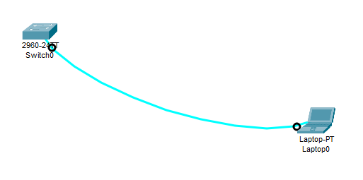
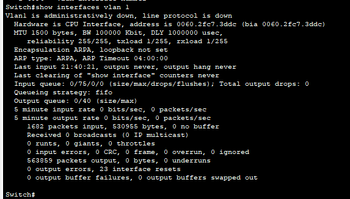

## Часть 1. Создание сети и проверка настроек коммутатора по умолчанию

### Шаг 1. Создаём сеть согласно топологии.

Используем коyсольное соединение потому, что с "завода" протоколы Telnet и ssh не включены.
### Шаг 2. Проверьте настройки коммутатора по умолчанию

#### Файл running configuration

#### a

Switch>enable 

Switch#show running-config 

Building configuration...

#### b
Коммутаторе 2960 имеет 24 FastEthernet

Коммутаторе 2960 имеет 2 GigabitEthernet.

Диапазон значений, отображаемых в vty-линиях 

line vty 0 4

line vty 5 15

#### c

Switch#show startup-config

startup-config is not present

Потому, что еще не сохраняли конфигурацию.

#### d

Switch#show interfaces vlan 1

Vlan1 is administratively down, line protocol is down

IP адрес не назначен

address is 0060.2fc7.3ddc

Данный интерфейс выключен (не сконфигурирован)

#### e

